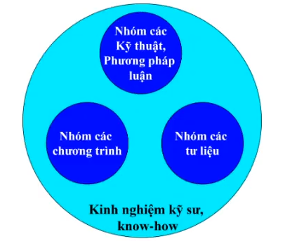
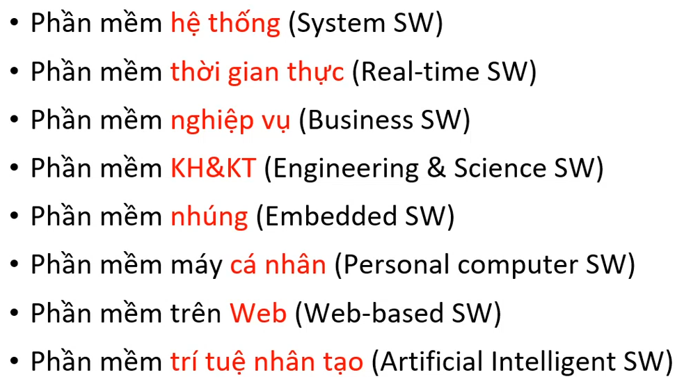
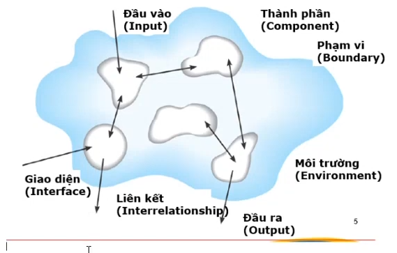
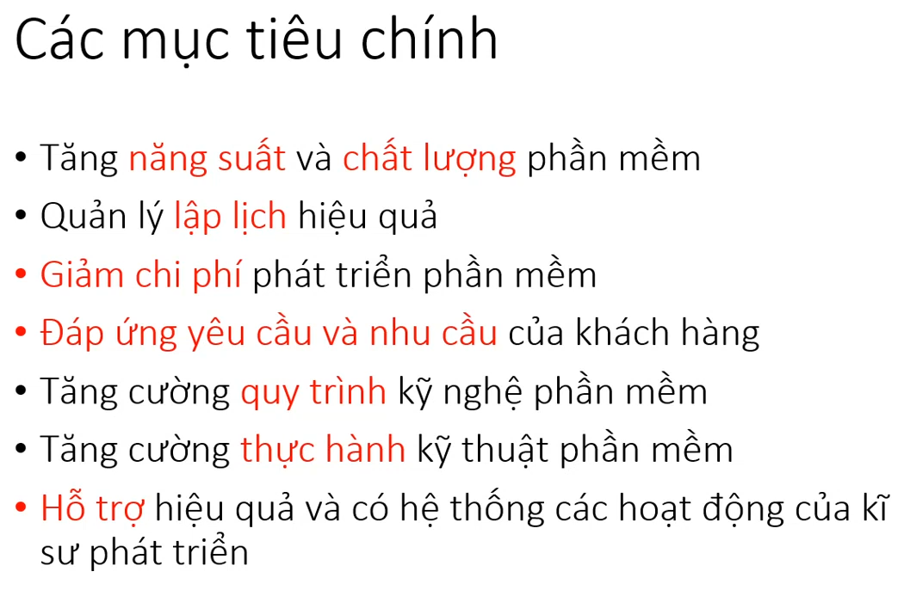
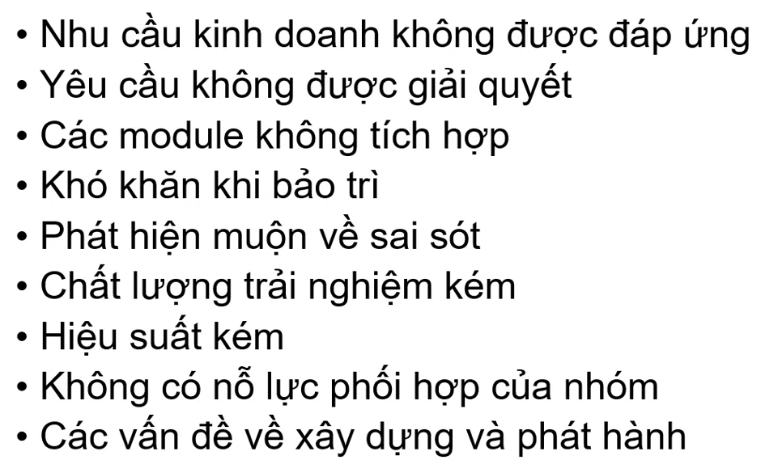
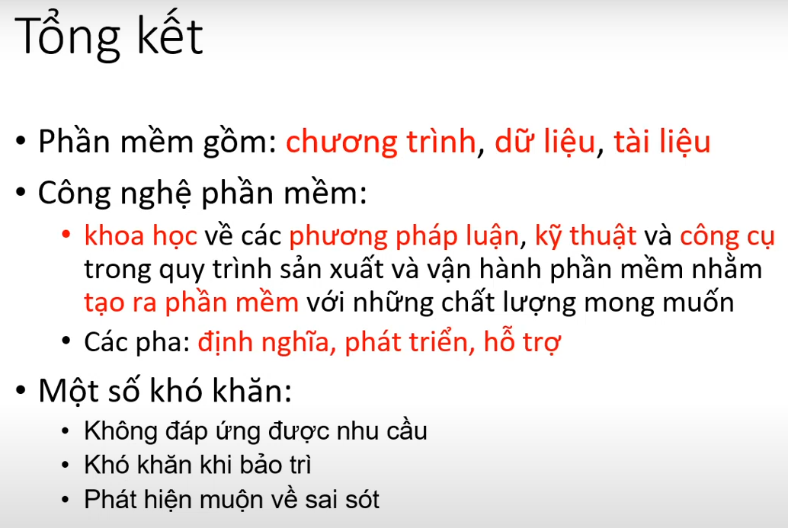

# Tổng quan về công nghệ phần mềm

## 1. Định nghĩa

so sánh khái niệm phần mềm (software) và phần cứng (hardware)

| phần mềm                                            | phần cứng                                |
| --------------------------------------------------- | ---------------------------------------- |
| phần logic (câu lệnh thực thi, dữ liệu, ...)        | phần vật lý (kim loại, điện tử, ...)     |
| trừu tượng                                          | hữu hình                                 |
| sản xuất thủ công, con ng là chính                  | sản xuất công nghiệp, dây chuyền tự động |
| không hao mòn, xu hướng tốt lên sau mỗi lần sửa lỗi | hao mòn, giá trị giảm dần theo tg        |
| giá trị tăng dần                                    | giá thành có thể giảm                    |

## 2. Phân loại phần mềm

Hệ thống (system): Khái niệm tổng quát. Hệ thống gồm nhiều thành phần, có quan hệ / tác động qua lại lẫn nhau. Mỗi hệ thống có một ranh giới xác định bên trong và bên ngoài (môi trường).

Hệ thống thông tin (IT system) bao gồm:

    - phần mềm
    - phần cứng (tbi tính toán, xử lý, kết nối mạng, ...)
    - con người
    - dữ liệu
    - quy trình xử lý (process)

## 3. Công nghệ phần mềm là gì?

Thời kỳ đầu giai đoạn khủng hoảng phần mềm (software crisis) -> chất lượng sản phẩm kém (chứa nhiều lỗi, không đúng theo yêu cầu, ...)

-> cần có những tìm hiểu, nghiên cứu chuyên sâu về phát triển phần mềm để xây dựng các phần mềm chất lượng

-> thuật ngữ "công nghệ phần mềm" ra đời

SE gồm 3 pha chính

    - pha định nghĩa: xác định yêu cầu - what
    - pha phát triển: xây dựng giải pháp - how
    - pha hỗ trợ: xử lý các thay đổi - change

## 4. Các vấn đề trong CNPM

## 5. Tổng kết

