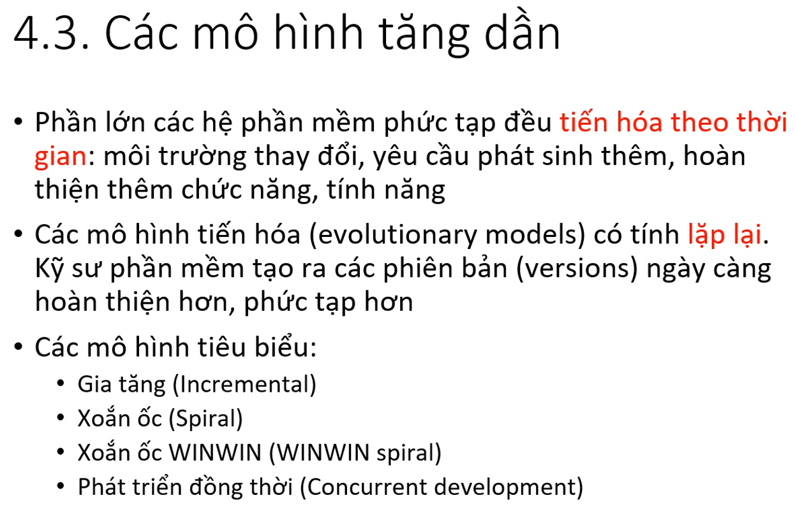

# Chương 2 vòng đời phần mềm

## 1. Hệ thống và phần mềm

## 2. Vòng đời hệ thống/phần mềm

## 3. Quy trình phát triển phần mềm

## 4. Các mô hình quy trình phần mềm

### 4.1 mô hình thác nước

### 4.2 mô hình mẫu thử

### 4.3 các mô hình tăng dần

các phần mềm có đặc trưng tiến hóa theo tg, khi có lỗi phát sinh -> sửa lỗi, nâng cấp, hoàn thiện dần.

thực hiện công việc lặp đi lặp lại nhiều lần

### 4.4 Mô hình gia tăng

### 4.5 mô hình phát triển ứng dụng nhanh

đặc điểm

    - phát triển tăng dần (gia tăng)
    - dựa trên thành phần có sẵn, tái sử dụng
    - thời gian phát triển ngắn

### 4.6 mô hình xoắn ốc

### 4.7 mô hình xoắn ốc WIN-WIN

### 4.8 tổng kết các mô hình

## 5. tổng kết

