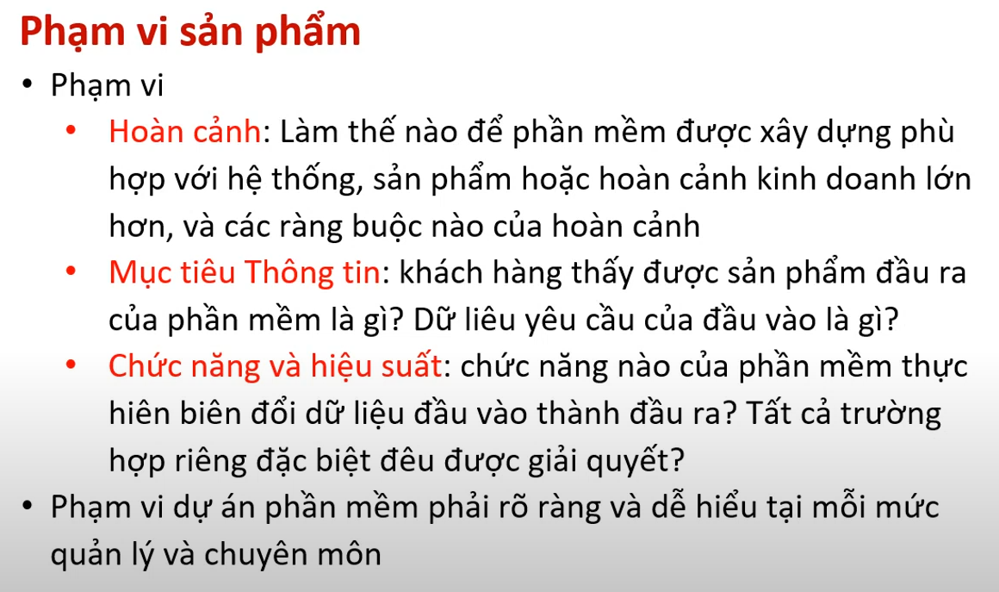

# Chương 4 Quản lý dự án phần mềm

## 1. Khái niệm chung

### a. Giới thiệu định nghĩa

có đặc điểm của dự án chung

### b. yếu tố con người

Team leader

### c. yếu tố sản phẩm

## 2. Quy trình

các pha quản lý dự án

## 3. rủi ro

