# Chương 6 kỹ nghệ yêu cầu phần mềm

## 1. Khái niệm

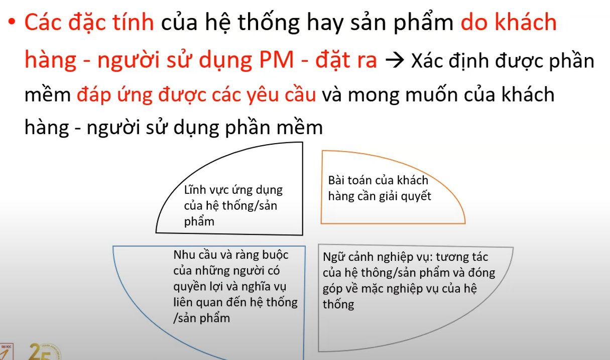
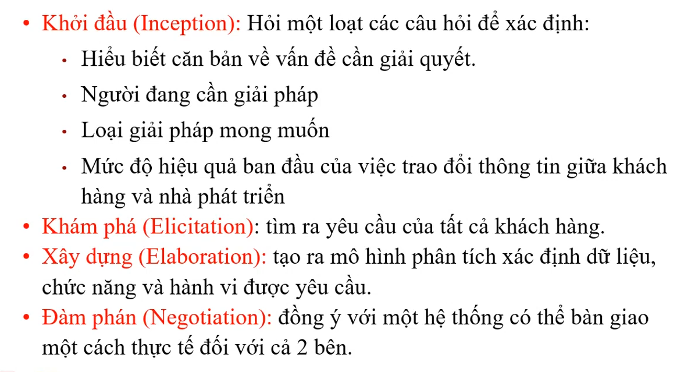
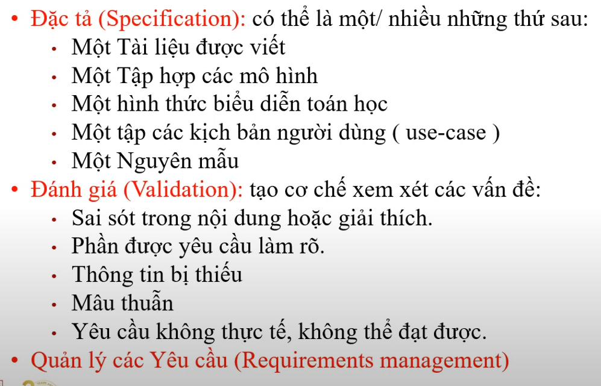

## 2. tầm quan trọng của yêu cầu phần mềm

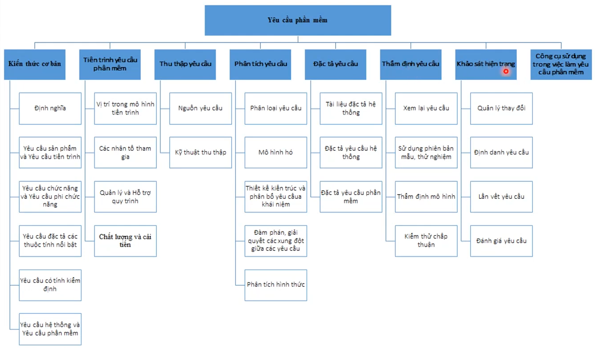
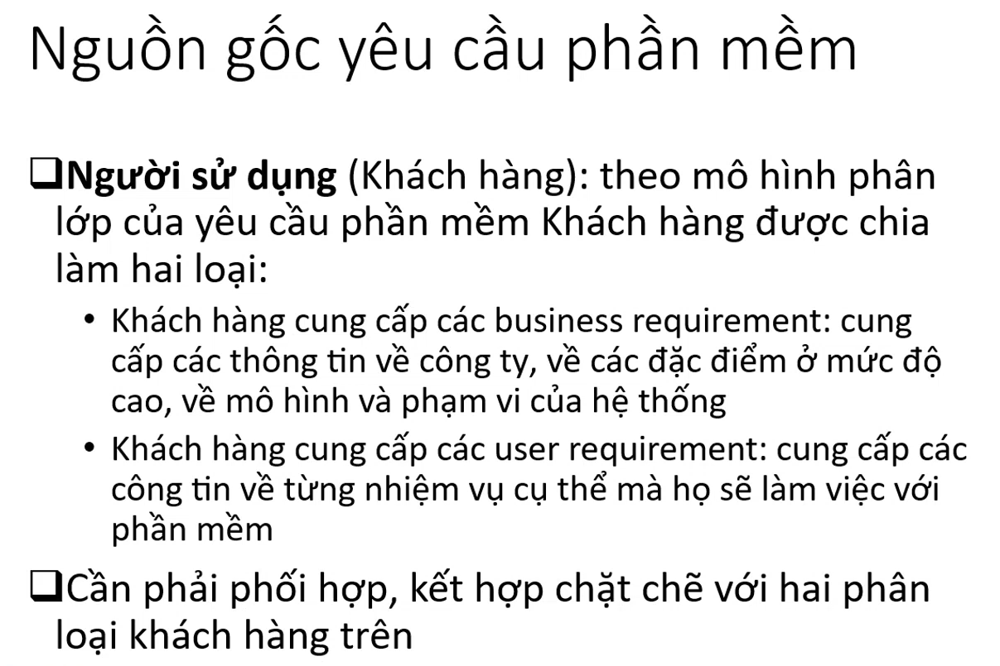
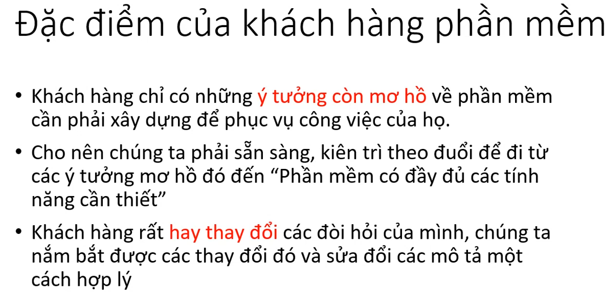

## 3. yêu cầu chức năng và các yêu cầu phi chức năng

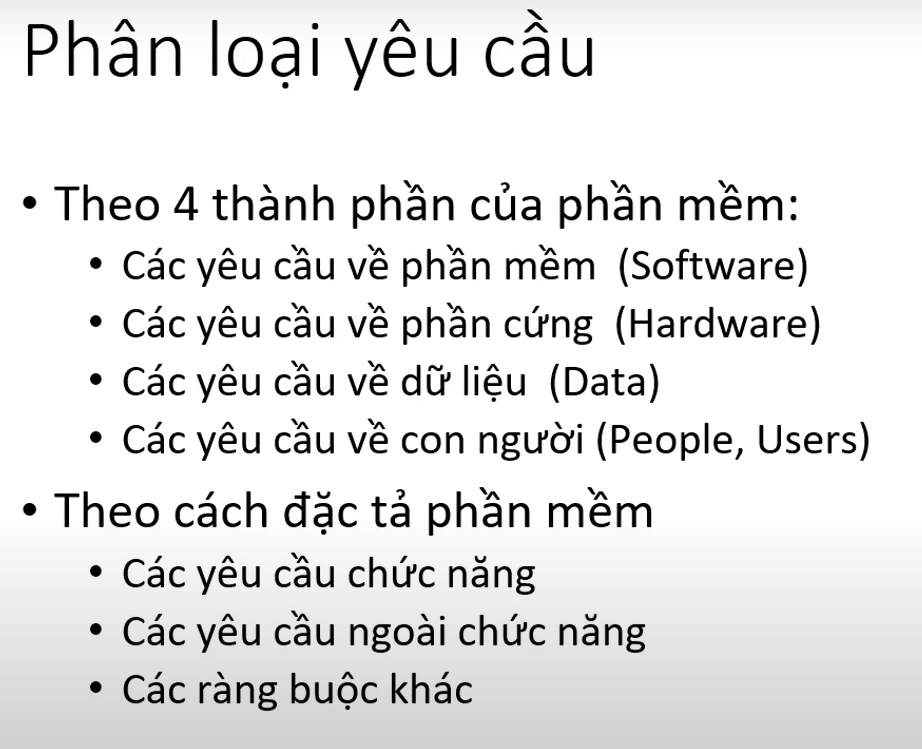
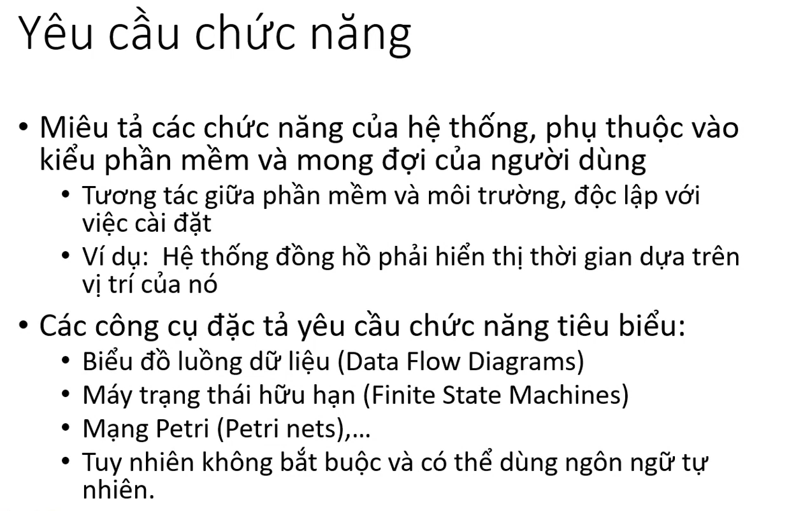
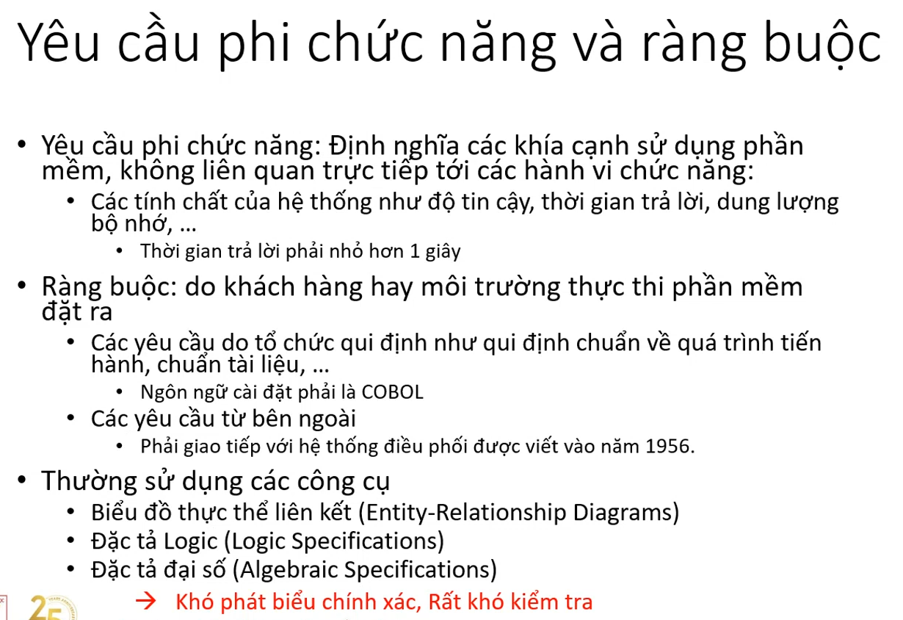

## 4. các hoạt động chính trong kỹ nghệ yêu cầu phần mềm

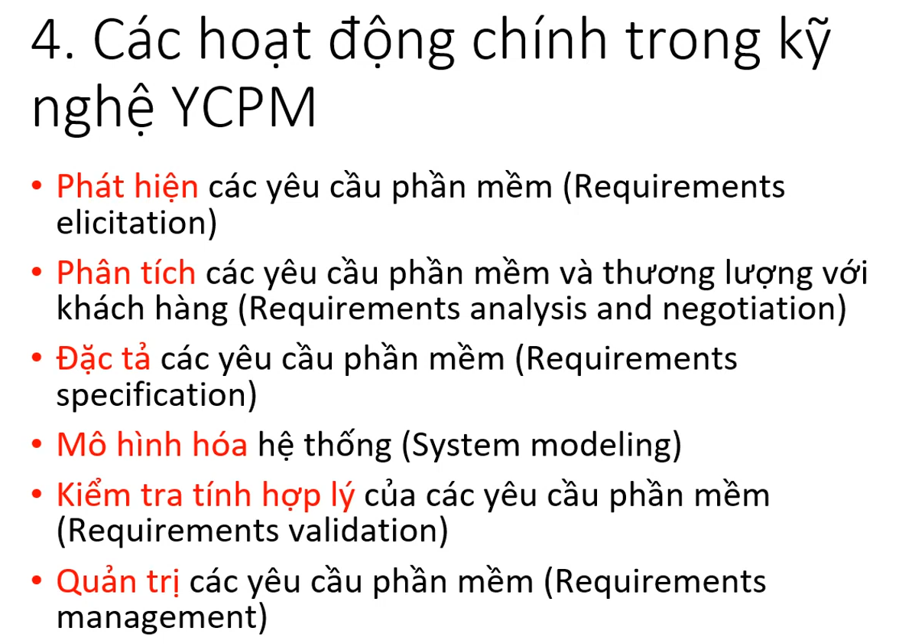
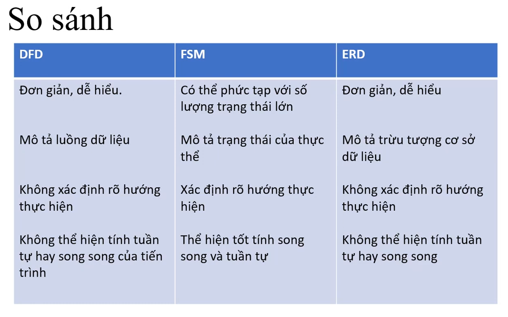
