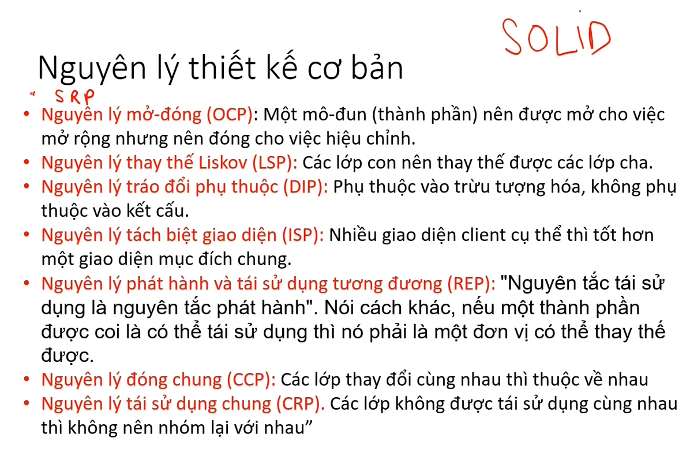

# Chương 7 thiết kế phần mềm

## 1. Tổng quan thiết kế phần mềm

thiết kế và chất lượng

nguyên tắc chất lượng

nguyên tắc thiết kế

## 2. các khái niệm trong thiết kế phần mềm

## 3. thiết kế kiến trúc phần mềm

thể loại kiến trúc

phong cách mô tả

kiểu kiến trúc

thiết kế kiến trúc

các bước thiết kế kiến trúc

## 4. thiết kế chi tiết phần mềm

nguyên lý thiết kế cơ bản

thiết kế mức thành phần

thiết kế thành phần quy ước

thiết kế thuật toán

thiết kế dữ liệu

## 5. tính móc nối (coupling) và tính kết dính (cohesion)

tính móc nối thì lỏng lẻo nhưng tính kết dính thì chặt chẽ

chất lượng của thiết kế

### sự gắn kết (cohesion)

các mức gắn kết

### ghép nối (coupling)

tóm lại
thiết kế sao cho kết nối giữa các modul lỏng lẻo hơn nhưng đơn vị logic của modul cao hơn (chỉ giải quyết một nhóm mối quan tâm duy nhất)

## tổng kết

