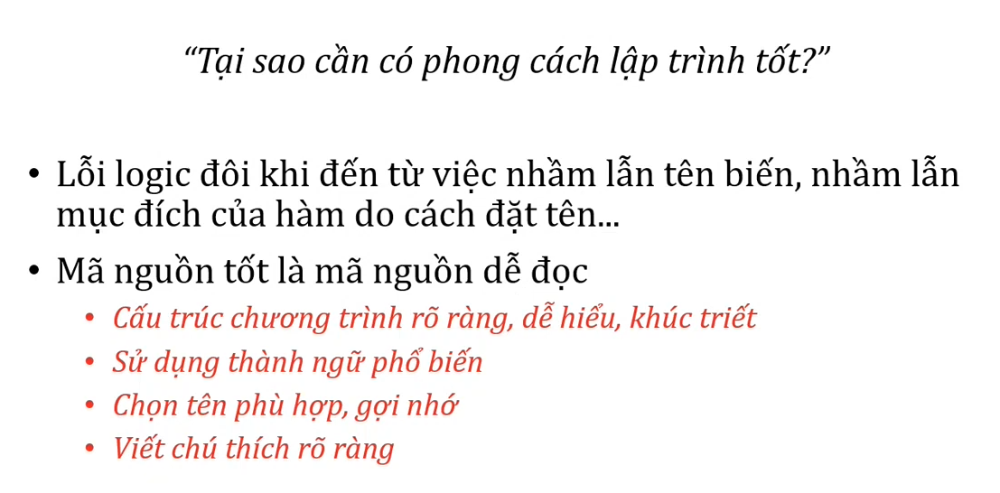

# Chương 8 Xây dựng phần mềm Software Construcsion

## 1. Khái niệm

mục tiêu

mô thức lập trình

mô thức lập trình hướng chức năng

mô thức lập trình hướng đối tượng

## 2. quy trình xây dựng phần mềm

## 3. quy ước viết mã nguồn

## 4. tái cấu trúc mã nguồn

cải thiện mã nguồn mà không làm thay đổi chức năng

clean code

dirty code

quy trình tái cấu trúc

mục tiêu

## 5. rà soát mã nguồn

