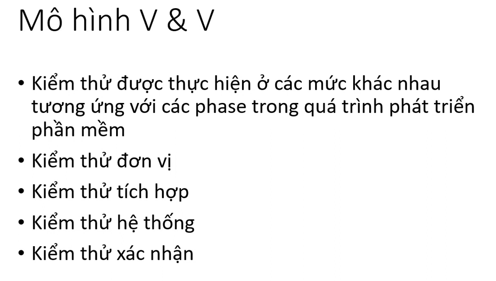
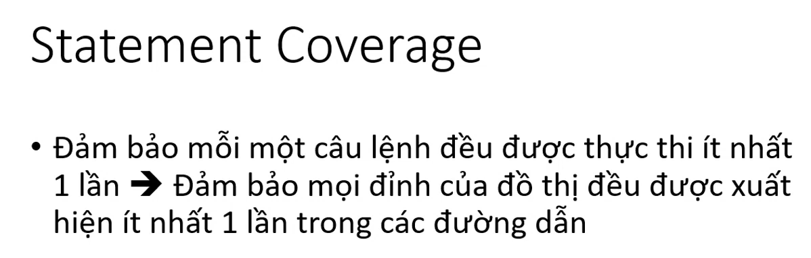
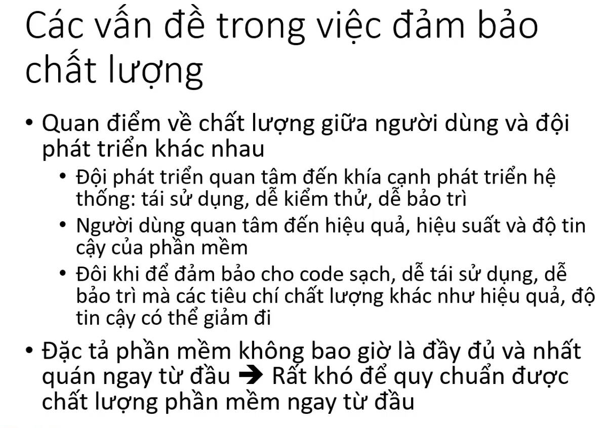
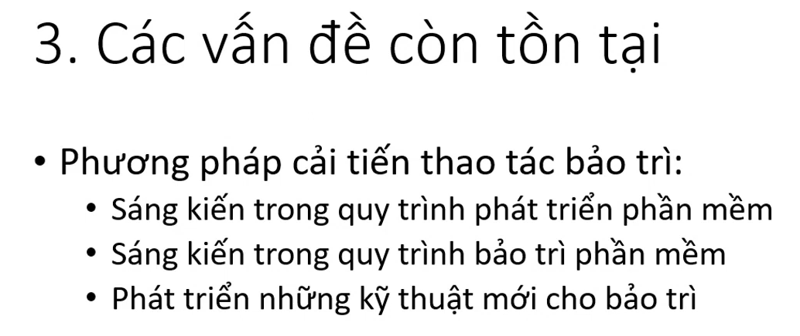

# Chương 9 đảm bảo chất lượng phần mềm - software quality assurence

## 1. Mô hình V&V

V&V: verification & validation
xác minh & kiểm chứng

## 2. các thuật ngữ

khó khăn

lưu ý

các kỹ thuật kiểm thử

## 3. kiểm thử hộp trắng

so sánh tiêu chí

## 4. kiểm thử hộp đen

## 5. quản lý chất lượng phần mềm

## 6. bảo trì phần mềm

bảo trì để tu sửa

bảo trì để thích hợp

bảo trì để cải tiến

bảo trì để phòng ngừa

quy trình bảo trì

sơ đồ bảo trì

các vấn đề còn tồn tại

sáng kiến

## tổng kết

